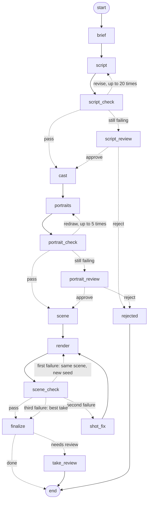

# Verbatim

A loose idea of one to three sentences becomes a vertical 9:16 micro-scene of 8–30 seconds with dialogue, and every line in it is spoken word for word.

## Run it

Docker is enough:

```bash
cp .env.example .env     # then put your OPENROUTER_API_KEY into .env
make up                  # UI on http://localhost:8088, API docs on http://localhost:8011/docs
make down
```

For development you also need [uv](https://docs.astral.sh/uv/), pnpm and ffmpeg:

```bash
make install
make infra migrate       # Postgres on :5434, Redis on :6380
make api                 # http://localhost:8010/docs
make worker
make web                 # http://localhost:5173
```

One command without the UI, as the task asks:

```bash
make run IDEA='A man walks into a saloon and mocks a big guy: "Nice hat, big man. Did your mother pick it out?" A fight starts.'
# or without uv:
docker compose --profile app run --rm worker python -m app.cli 'A man walks into a saloon ...'
```

Both ways write every run to `runs/<id>/` on your machine, ending with `final.mp4`. Exit code `0` means done, `2` means a person has to look at the best take, `1` means the run stopped.

Every run calls OpenRouter and costs money. `VIDEO_RESOLUTION` (`480p`, `720p`, `1080p`) and `MAX_USD_PER_RUN` keep the spend in check.

## Examples

`examples/` holds the four scenes shot with real models while this was built. They are committed on purpose: `make up` and `make migrate` load them into the database, so the UI shows real scenes right after cloning. Every file of a run is there, from `brief.json` to `final.mp4`, including the takes the checks rejected. Your own runs land in `runs/`, which git ignores.

| Scene | Resolution | Takes | Cost | Outcome |
|---|---|---|---|---|
| [Saloon](examples/runs/d8842b99-d512-4563-ad03-8e31070e0c43/final.mp4), the idea from the task | 480p | 3 | $2.42 | paused for a person, accepted |
| [Bookshop](examples/runs/c31ca094-8917-469d-8ebd-1eb93dbd39c2/final.mp4) | 480p | 2 | $1.53 | done |
| [Space greenhouse](examples/runs/bab3a05c-a0af-4a9f-8278-944332b2589f/final.mp4) | 1080p | 2 | $5.08 | done |
| [Night train](examples/runs/a7aacbfb-43eb-43aa-b838-6df762ba057f/final.mp4) | 480p | 1 | $0.83 | done |

## Keys

Only `OPENROUTER_API_KEY`. Everything goes through OpenRouter:

| Job | Model |
|---|---|
| Brief, script, critic, casting, staging, shot rebuild | `anthropic/claude-sonnet-5.5` |
| Character portraits | `google/gemini-3.1-flash-image` |
| Video with native audio | `alibaba/wan-3.0` |
| Speech recognition with word timestamps | `openai/whisper-large-v3` |
| Portrait and scene judge | `google/gemini-3.8-flash` |

## How a run works

The pipeline is a LangGraph state graph. The order of steps lives in code; the models only make decisions inside a step. State is checkpointed to Postgres after every node, so a run survives a worker restart and can pause for a person.



`script_review`, `portrait_review` and `take_review` pause the graph with `interrupt()`. The UI or `POST /api/runs/{id}/review` resumes it.

A run that stopped on an error (the provider failed, a job timed out, the money limit was hit) can continue: `POST /api/runs/{id}/continue` reruns only the failed step, and everything finished before it comes from the checkpoint. A failed video job is sent again; one that is still alive is polled again, so it is not paid for twice. Start over in the UI creates a new run with the same idea.

### Why the lines stay word for word

- Lines are written once, in `script.json`. Quoted speech from the idea is extracted by code, and the screenwriter refers to it by index, so the model never retypes it.
- After the script check the text is frozen. The director's response schema has no field for the words; code inserts them into `scene.json` and checks every handoff character for character.
- The prompt for Wan is rendered by a template, not by a model.
- The speech check aligns the Whisper transcript with `script.json` word by word: the take passes only with zero errors, the right speaker and a valid format (`ffprobe`: 9:16, 8–30 s, audio track). Gemini judges the speaker on frames of the line window: a line said by another character, or by a face with a still mouth, fails; a speaker filmed from behind or off screen is fine.
- Whisper writes sounds as notes (`*Drum roll*`, `[Music]`) and invents a few phrases over silence (`Thank you.`). Such segments are dropped before the alignment unless the line itself contains them, and every dropped piece is kept in `judge-N.json`. Only heard words are dropped, never expected ones, so a line that was not said still fails.
- A failed take is shot again with a new seed; after the second failure the director rebuilds the failing shot (duration, delivery, camera, background level) without touching the words; after the third the best take waits for a person.
- One thing is outside our control: Alibaba's `prompt_extend` rewrites prompts by default and cannot be switched off through OpenRouter. The speech check catches its effect.

Every artifact of a run lands in `runs/<id>/`: `brief.json`, `script.json`, `critique-N.json`, `cast.json`, `refs/`, `portraits-N.json`, `scene.json`, `requests/`, `takes/N.mp4`, `attempt-N.json`, `judge-N.json`, `shot_fix.json`, `final.mp4`, `manifest.json`. `N` is the round or the take; `checks/` keeps the audio and frames the judge got.

## Layout

```
backend/
  main.py                  FastAPI app
  app/api                  routers and error handlers
  app/services             use cases behind the routes
  app/repository           Postgres access and run artifacts on disk
  app/models, migrations   SQLAlchemy models and Alembic
  app/schema               API request and response models
  app/worker               Celery app and tasks
  app/pipeline/graph       LangGraph state, nodes, routing
  app/pipeline/agents      one class per LLM role
  app/pipeline/prompts     system prompts
  app/pipeline/contracts   Pydantic models of every file a run writes
  app/pipeline/rules       code checks that keep the words intact
  app/pipeline/checks      word alignment, verdicts, judge windows
  app/pipeline/adapters    scene.json to a Wan 3.0 request
  app/providers            OpenRouter clients
  app/media                ffmpeg and ffprobe helpers
  tests/                   unit and graph tests; tests/fakes stands in for every model
frontend/                  React, TypeScript, TanStack Query, SCSS modules
```

## Checks

```bash
make check    # ruff, ruff format, mypy --strict, pytest; eslint, tsc, vite build
make types    # regenerate frontend API types from the backend OpenAPI schema
```

Tests never call OpenRouter: `tests/fakes` stands in for every model. It can make a take drop a word or a video job fail, so the graph tests walk through retry, shot rebuild, the review pause and continue.

## API

| Method | Path | |
|---|---|---|
| `POST` | `/api/runs` | start a run from `{ "idea": "..." }` |
| `GET` | `/api/runs` | recent runs |
| `GET` | `/api/runs/{id}` | status and every step, polled by the UI |
| `GET` | `/api/runs/{id}/lines` | each line next to what was heard |
| `GET` | `/api/runs/{id}/video` | the final take |
| `POST` | `/api/runs/{id}/review` | `{ "approve": true }` resumes a paused run |
| `POST` | `/api/runs/{id}/continue` | continues a run that stopped on an error from the failed step |

## Prompts

The script critic, the portrait judge and the scene judge adapt the review prompts from *One Sentence, One Drama* (arXiv:2605.22144, Appendix M). The producer, screenwriter, casting, director and shot rebuild prompts follow the story structure described in that paper and Alibaba's prompt guide for Wan 3.0.
